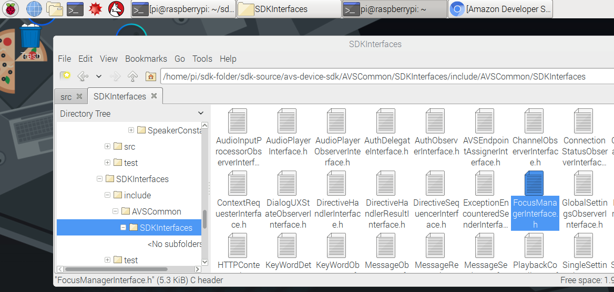
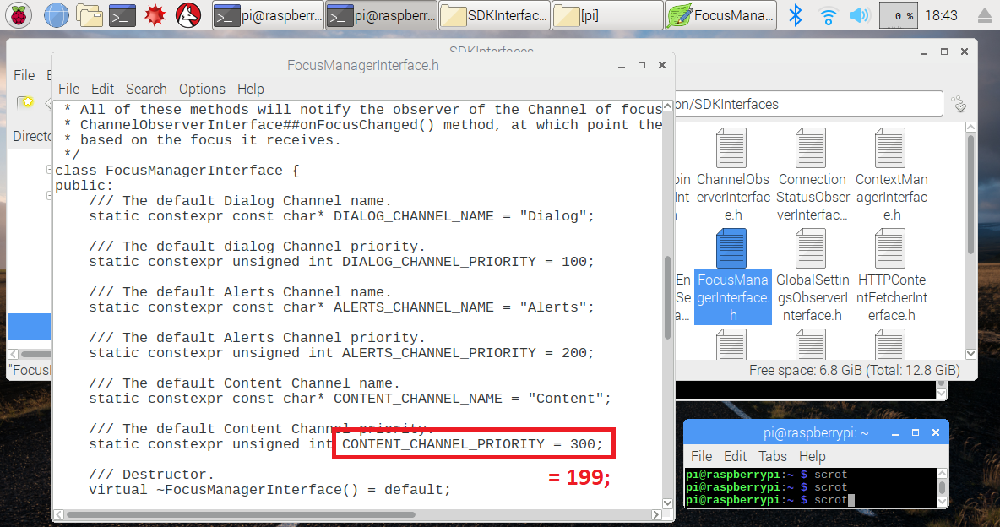

### Alexa Focus Manager Library挙動の変更
一つのスピーカーしか搭載されていないデバイスであっても、複数の**Capability Agents**がそのスピーカーを利用しようとします。**Focus Manager**は一貫したユーザ体験と、複数のエージェントが同時に音声出力を行わないように制御します。それではどのようにスピーカーに対して制御を行っているのでしょうか？いくつかの機能(例えば、**Speech**、**Alarms**、**Music**)を**Channels**に割り当てることで、Focus Managerが個々の優先度のストラクチャーを定義します。

製品の重要な機能に対して、中断されることを回避したいというユースケースはないでしょうか？例えば、自動車のナビゲーションシステムで、Alexaによる経路情報提供中に、アラーム機能が鳴ったことでスピーカーの制御を持って行かれたくはないかと思います。それではサンプルアプリのForcus Managerでその挙動を確認してみましょう。

{:.steps}
### ２つの共同するCapability Agentを設定

サンプルアプリに設定されている既存の**Channel Priority**に則って、Focus Managerが**Media Player**の制御を取得するシチュエーションを作成します。

1. "Alexa、20秒のタイマーをセットして"と話しかけます。
2. Alexaより"20秒のタイマーを開始します。"という確認を受信します。
3. 続いて、"Alexa、歌を歌って"と話しかけます。
4. 数秒後に、Alexaが歌を歌い始めます。
5. ...歌が終了する前に、アラームが鳴ります!! するとデバイスで、歌の**Focus**が外されます。
6. "Alexa、止めて"と話しかけると、アラームが止まります。
7. **Alarms**のCapability Agentが停止されると、デバイスの**Foreground**チャンネルを歌が再取得します。

この歌の再生が実際の経路情報で、高速道路の出口を伝えるタイミングだった場合のことを想像すると、きっと高速を降りるのをミスしてしまうと思います。それではこのデバイスで、Focus Managerを修正し、**Content**チャンネルの優先度を**Alarms**チャンネルより上にしてみましょう。

### Focus Managerインターフェースの修正

1. ファイルマネージャを利用して、*/home/pi/sdk-folder/sdk-source/avs-device-sdk/AVSCommon/SDKInterfaces/include/AVSCommon/SDKInterfaces*に移動します。
2. **FocusManagerInterface.h**を右クリックして、**Text Editor**を選択し、ファイルを開きます。

3. 下にスクロールするとFocusManagerInterface内にチャンネル優先度のリストを確認できます。数字が小さいほうが優先度が高くなります。-なぜ1/2/3ではなく100/200/300で設定されているのでしょうか？これは新しいチャンネルを作成された場合にも、柔軟に優先度を指定できるようにしているためです。例えばチャンネル1-99を作成した場合、これらは**Dialog**よりも優先度が高く設定することが可能となります。
4. 本エクササイズでは、**Content**の優先度を上げることで、**Alerts**によって割込が発生しないようにします。`CONTENT_CHANNEL_PRIORITY`が`300`に設定されています。- 300から**199**に変更することで、Alertsより優先度を高く設定します。**FocusManagerInterface.h**を保存して閉じます。

  

### 修正したSample appのリビルド

1. 修正を反映させるために、Sample Appをリビルドする必要があります。はじめに、(まだアプリが動いている場合)**q**を入力し**return**を押して、既存のSample Appを終了させます。ターミナルを起動し、下記のコマンドを入力してSample Appのリビルドを行います:

`cd /home/pi/sdk-folder/sdk-build/SampleApp
make
`
2. 修正した部分のライブラリがリビルドされることが確認できます。- この処理は数分かかります。
3. 対象のSampleAppのビルドが100%で完了したメッセージが表示されます。 - Sample Appを再起動して同じインターラクションを実施してみましょう！
4. Sample Appを起動するため、ターミナルで下記のコマンドを実行します：

`cd /home/pi/sdk-folder
sudo bash startsample.sh
`

再度20秒タイマーを設定し、設定が完了したメッセージを確認した後 - Alexaに音楽の再生開始を伝えます。今回はタイマーが鳴った際に、音楽は中断されたでしょうか？

ぜひ**Focus Manager**を使って製品のユースケースにおいてユーザ体験に最も適した優先度の設定を行ってみてください。ユーザはどのような状況下でもAlexaに話しかければ**常に**それを聞き取り応答することを期待しているということを、Alexa搭載製品を製造される際には意識してください。
{:.steps}

### プロトタイプ環境での体験
1. **Dialog**よりも高い優先度のものを作った場合、どのようなことが起きるでしょうか？
2. LabマニュアルStep8の手順にしたがい**Unit Test**を再実行して見ましょう。どのような結果が起きましたか？
