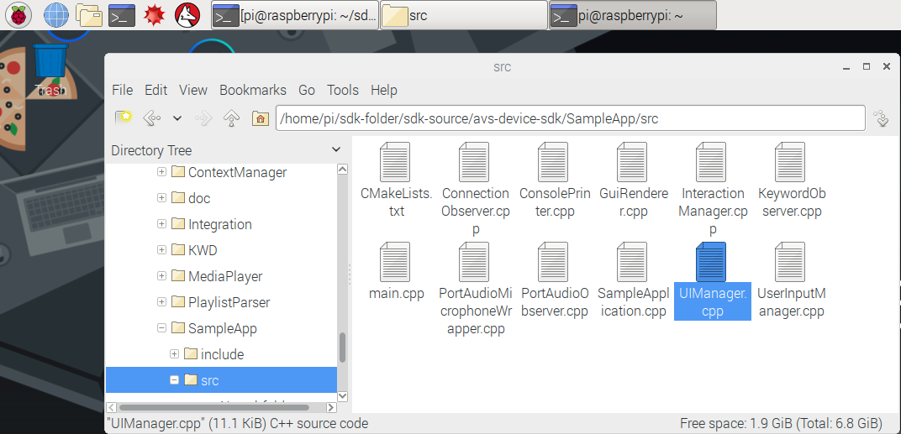
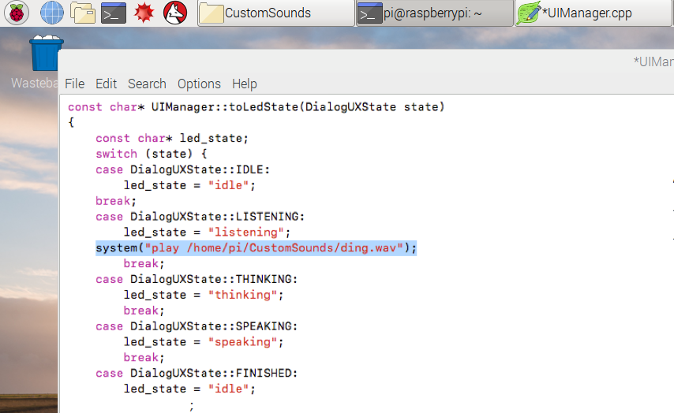

### UImanagerファイルの修正

Alexa搭載製品に話しかけた際に、ウェイクワードの検知をわかるようにしたいと思うことがあります。これらは、製品のLEDの点灯や、色の変化で認識することもできますが、デバイスが見えないところにある場合はどうでしょうか？今回のケースでは、Alexaが検知した際に、オーディオキューを再生することで認識できるようにします。本手順では、**User Interface Manager**を修正し、Alexaのステートが**LISTENING**に変わるタイミングで、**通知音**を再生させます。

*/home/pi/sdk-folder/sdk-source/avs-device-sdk/SampleApp/src/*に移動し、テキストエディターを利用してUIManager.cppを開きます。

ファイルの上部に記述されている#include statementsの中に、下記を追加します:`#include <cstdlib>`これにより次の手順で追加する再生ファンクションを有効にします。

OSイメージの中に、本エクサイズで利用できるテスト用WAVファイルが/home/pi/CustomSoundsフォルダ内に格納されています。オーディオキューとして利用するため、このファイルのパスを追加します。UIManagerファイルの下部に`printState()`ファンクションで、`case DialogUXState::LISTENING:`と記載されている箇所に下記のコマンドを追記します。
`system("play /home/pi/CustomSounds/ding.wav");`

テキストファイルを閉じる前に保存します。オーディオファイルを再生させるためには、**sox**をダウンロードし、修正を反映させるためにサンプルアプリを再コンパイルします。はじめに、"**q**"を入力し、**エンター**を押すことで、起動しているサンプルアプリを終了させます。(起動している場合のみ) 
ターミナルを起動して、下記を実行:

`sudo apt-get install sox`

インストール確認で"y"を入力します、ダウンロードは数秒で完了します。

サンプルアプリをリビルドするため、ターミナルで下記のコマンドを入力します:

`cd /home/pi/sdk-folder/sdk-build/SampleApp
make
`

リビルドされる修正ファイルが表示され、数分で完了します。
100%で完了した後、ターミナルで**startsample.sh**スクリプトを実行することでサンプルアプリが再起動されます:

`cd /home/pi/sdk-folder
sudo bash startsample.sh
`

{:.verify}
### チェックポイント11
プロトタイプデバイスにウェイクワードの"Alexa"と話しかけるたびに(Alexaのステートが**Listening...**に変更)、カスタムした音声が再生され、Alexaがクラウドと通信するためのチャンネルを開き、リクエストを待ちます。エラーが発生する場合は、**s**を入力し、インターラクションを中断し再実行することができます。ネットから他の.wavファイルを探し、UI managerのそれぞれのステートごとに異なる音声を指定することも可能です!

実際に商用製品を出荷する際は、エンドユーザはあらゆるAlexa搭載製品で同じようなユーザ体験を得られることを期待しています。ビジュアルや音声キューの実装に関するベストプラクティスは、[AVS UX Design overview page](https://developer.amazon.com/docs/alexa-voice-service/ux-design-overview.html)で確認できます。
---
