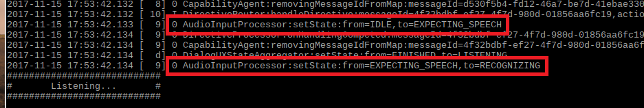

{:.steps}
### プロトタイプとのインターラクション
これでウェイクワードの"Alexa"と話しかけるだけで、Intel Speech Enabling Developer Kitと会話ができるようになります。下記を試して、ターミナルウィンドウに表示されるそれぞれのディレクティブやイベントを確認します。

* "Alexa", ”いま何時？"と話しかけます。
* "Alexa", ”目黒の天気を教えて？"と話しかけます。
* "Alexa", ”5秒のタイマーをセットして"と話しかけます。
* "Alexa", ”TuneInでクラッシックFMを再生して"と話しかけます。
* "Alexa", ”こんにちは"と話しかけます。
* "Alexa", ”冗談を言って"と話しかけます。
* "Alexa", ”人生の意味ってなに？"と話しかけます。
* "Alexa", ”ハッピバースデーを歌って"と話しかけます。
* "Alexa", ”どこで生まれたの？"と話しかけます。
* "Alexa", ”なにか歌って？"と話しかけます。

### マルチターンインターラクションを試す

* "Alexa"と言ったあと、"12:30にアラームをセットして"と話しかけます。午前か午後かを確認するレスポンスを受けます。”午後”と答えてください。DEBUG9が設定されている場合、**Listening...** のところまでスクロールで戻り、ウェイクワードを言わなくとも、**Audio Input Processor** (AIP) がIDLE`から`EXPECTING_SPEECH`そして`RECOGNIZING`に変わっていっていることを確認します。通常AIPはクライアントで起動している**Wake Word Engine** からトリガーされます。しかしこのケースでは、クラウドからクライアントに送信された**Directive**によりアクティベートされています。

マルチターンインターラクションはより、**Alexa**と都度発声する必要がなく、Alexaとの会話を継続できることから、より自然にコミュニケーションを行っている感覚を得られます。

---
